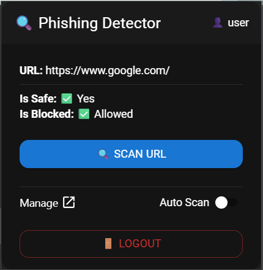
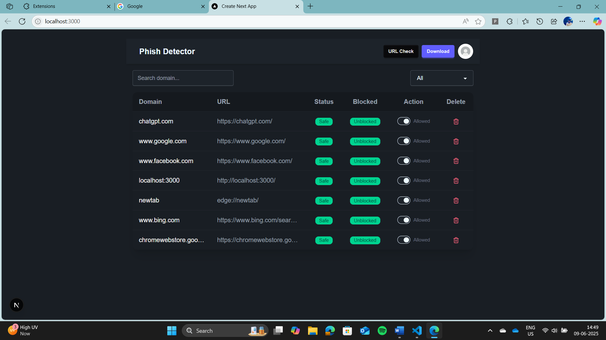

# 🛡️ Real-Time Phishing Detector


> 🔐 A browser extension powered by Machine Learning and Flask backend to detect phishing websites **in real-time** and protect users from malicious attacks.

---

## 📸 Demo




---

## 🔍 Features

- 🌐 Real-time URL scanning and phishing detection
- 🧠 ML-based URL classification
- 🧩 Browser extension (React + DaisyUI)
- 🔒 User authentication with JWT
- 📡 Flask API with MongoDB integration
- 🔔 Automatic redirection from unsafe websites
- 📊 Admin dashboard with URL & user management (Next.js)

---

## 🛠️ Tech Stack

| Component        | Technology                       |
|------------------|-----------------------------------|
| Frontend         | React (Vite), DaisyUI             |
| Backend          | Python Flask, JWT                |
| Database         | MongoDB                          |
| Browser Extension| Chrome/Edge/Firefox Compatible   |
| Deployment       | Azure (IIS / App Service)         |

---

## ⚙️ Installation

### 1. Clone the repository

```bash
git clone https://github.com/likithsshetty/Real-Time-Phishing-Detector.git
```

### 2. Create Conda environment and install all packages.
navigate to backend folder and use the below command to install the packages.

```bash
conda env create -f environment.yml
conda activate myenv
```

### 3. To install node dependencies for frontend.
navigate to frontend folder and use the below command to install the modules.

```bash
npm install
```

### 4. To install node dependencies for Extension.
navigate to extension folder and use the below command to install the modules.

```bash
npm install
```

Run ```bash npm run build``` to create extension
Add the extension folder in your desired browser

---

## ⚙️ Running the project

use ```bash python main.py``` inside the backend folder
use ```bash npm run dev``` inside the frontend folder
